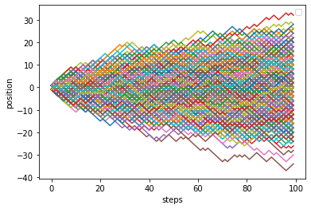

# PyMCSL (Python Monte Carlo Simulation Library)


[](https://zenodo.org/badge/latestdoi/500016774)

By Filipe Chagas, 2022

Since Monte Carlo simulations can be cumbersome to implement, I created this library to make it easier for you to implement Monte Carlo simulations in Python. PyMCSL (Python Monte Carlo Simulation Library) is a library that provides ready-made simulation environments, dealing internally with the execution of the simulation steps, with the registration of the variable states and with the obtaining of the results. The programmer who uses PyMCSL to develop his simulations only needs to worry about creating functions to define the behavior of the stochastic system. See the documentation for more information.

[DOCUMENTATION](https://pymcsl.readthedocs.io/)

## Basic code structure

```python

import pymcsl as mcs

env = mcs.MonteCarloSimulationEnv(
  variables=[ #environment variables list
  #variables must be declared as tuples in the format (name, type, default value).
  #only int, float, str and bool types are allowed for variables
      ('var1', int, 0),
      ('var2', float, 0.0),
      ('var3', bool, False),
      ('var4', str, 'default'),
      ...
  ],
  n_subsimulations = N_SUBSIMULATIONS, #number of subsimulations
  n_steps = N_STEPS #number of steps per subsimulation
)

@env.subsim_begin
def beginf(context: ContextType):
  """
  Params:
    context (ContextType) - object that gives read and write access to all the current states of the variables.
  """

  """
  code to be executed before the first subsimulation step.
  """

@env.subsim_step
def stepf(context: ContextType, step: int):
  """
  Params:
    context (ContextType) - object that gives read and write access to all the current states of the variables.
    step (int) - step index (starting at 0).
  """

  """
  code to be executed at each subsimulation step.
  """

if __name__ == '__main__':
  env.run() #run the simulation

  """
  code to be executed after the simulation.
  """
```

## Examples

### Galton Board

[see the tutorial](https://pymcsl.readthedocs.io/en/latest/examples/galtonboard.html)


Code:

```python
import pymcsl as mcs
import numpy as np
import matplotlib.pyplot as plt

#One subsimulation for each ball
N_SUBSIMULATIONS = 1000

#One step for each row of pegs
N_STEPS = 100

env = mcs.MonteCarloSimulationEnv(
    variables=[
        #(name, type, default value)
        ('x', int, 0) #horizontal position of the ball 
    ],
    n_subsimulations = N_SUBSIMULATIONS, 
    n_steps = N_STEPS 
)

LEFT = -1
RIGHT = 1

@env.subsim_begin
def beginf(context):
    #creates a random variable for the horizontal moving of the ball in each step.
    context.direction = mcs.DiscreteRandomVariable({
        #{outcome: probability}
        LEFT: 0.5,  
        RIGHT: 0.5
    })

@env.subsim_step
def stepf(context, step):
    #at each step, the ball passes through a row of pegs.
    context.x += context.direction.evaluate() #move the ball left or right

if __name__ == '__main__':
    env.run() #Run the simulation

    #Get the time evolution of x over all subsimulations
    xh = env.get_variable_histories('x') #xh[subsim index, step index]

    #Plot the trajectory of each simulated ball
    for subsim_index in range(N_SUBSIMULATIONS):
        plt.plot(xh[subsim_index, :])

    plt.xlabel('steps')
    plt.ylabel('position')
    plt.legend()
    plt.show()
```

Output:
